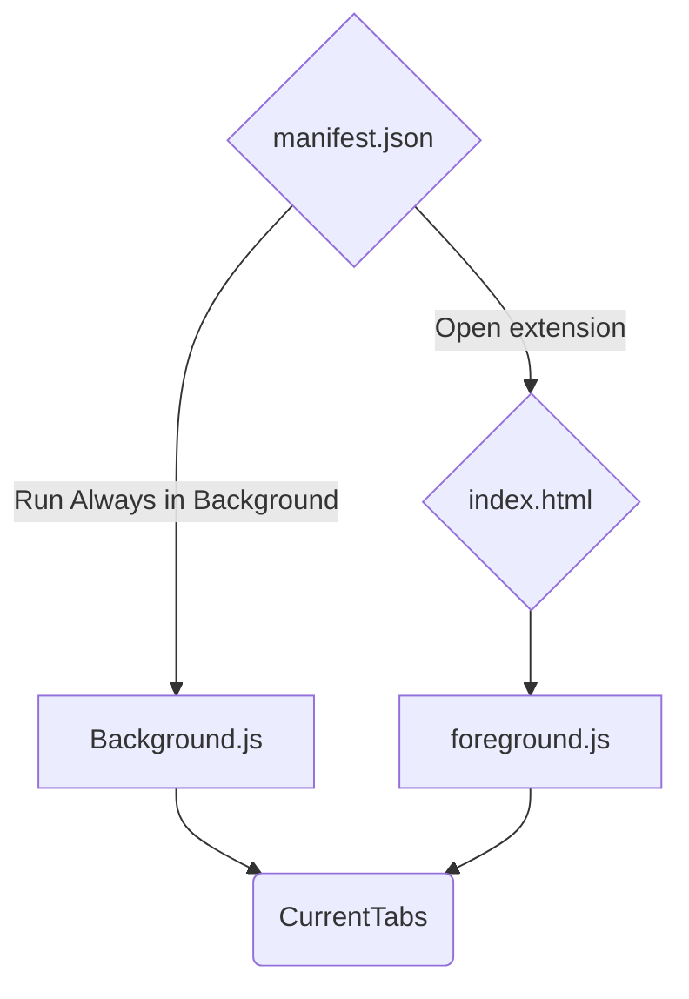

# Oraganization

```mermaid
graph 
A{manifest.json}
B[Background.js]
D(CurrentTabs)

B_isOpen{index.html}
C_isOpen[foreground.js]

A -- Run Always in Background --> B --> D
A -- Open extension --> B_isOpen --> C_isOpen --> D
```
