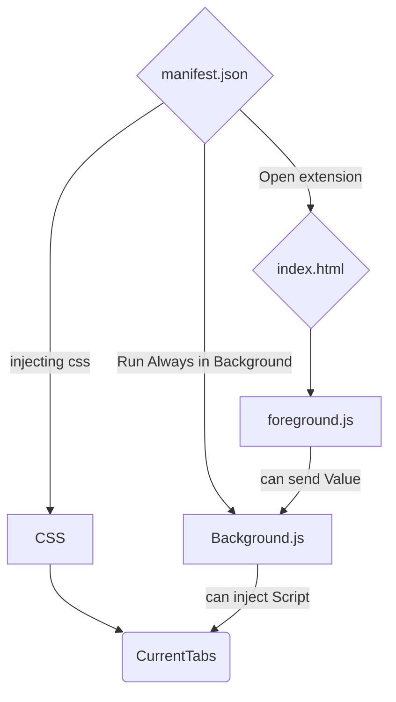
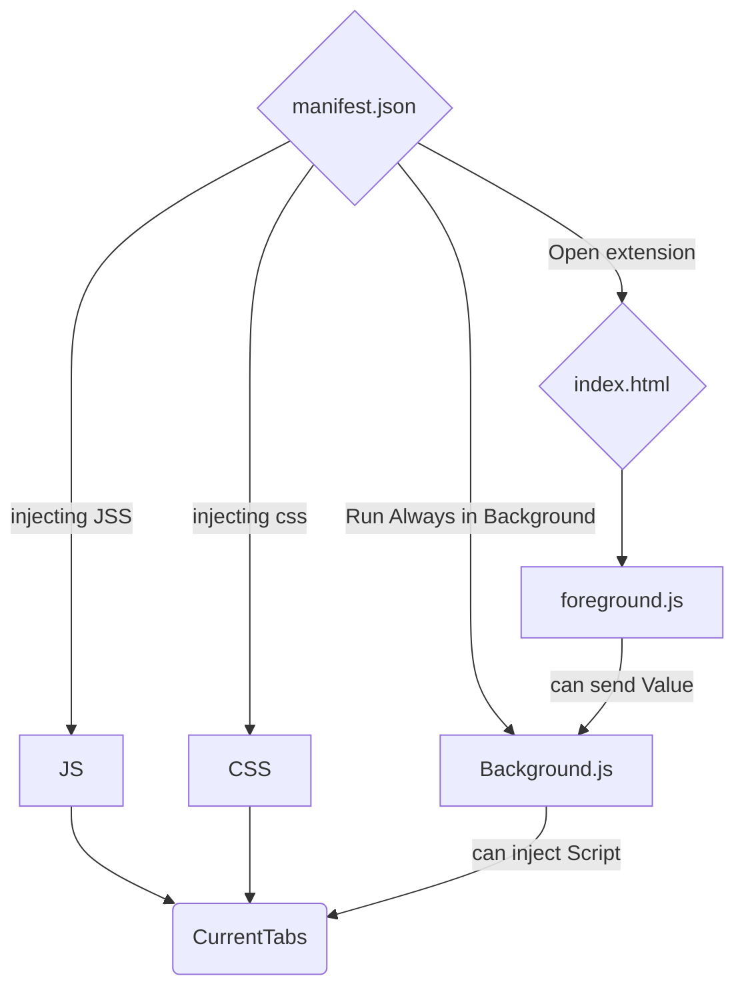

# Oraganization

```mermaid
graph 
A{manifest.json}
B[Background.js]
D(CurrentTabs)

B'[CSS]

B_isOpen{index.html}
C_isOpen[foreground.js]

A -- injecting css --> B' --> D
A -- Run Always in Background --> B -- can inject Script --> D
A -- Open extension --> B_isOpen --> C_isOpen -- can send Value --> B
```

# Possibilities

```mermaid
graph 
A{manifest.json}
B[Background.js]
D(CurrentTabs)

B'[CSS]
B''[JS]

B_isOpen{index.html}
C_isOpen[foreground.js]

A -- injecting JSS --> B'' --> D
A -- injecting css --> B' --> D
A -- Run Always in Background --> B -- can inject Script --> D
A -- Open extension --> B_isOpen --> C_isOpen -- can send Value --> B
```
